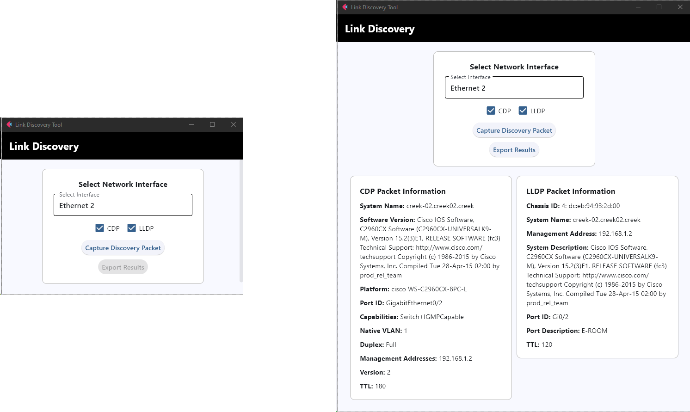

# CDP-Discover

A simple Python application to listen for CDP/LLDP packets and parse them into a Flet UI.

## Requirements

- **Scapy** (For interaction with network packets, https://pypi.org/project/scapy/)
- **Psutil** (For network interface selection, https://pypi.org/project/psutil/)
- **Flet** (For the GUI, https://pypi.org/project/flet/)

